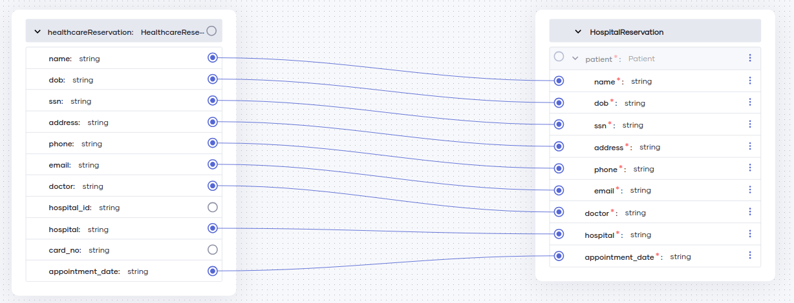
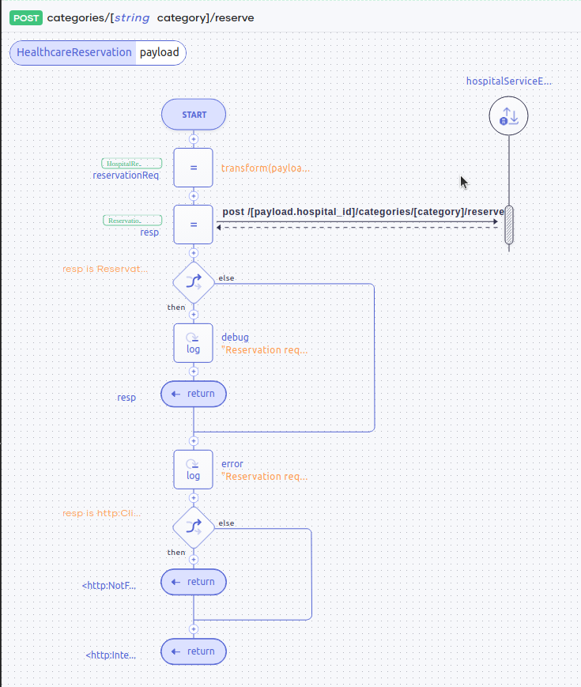

# Transform message formats

## Overview

In this tutorial, you will develop a service via which you can reserve appointments at a hospital. The requests are transformed from one format to another and forwarded to the hospital service.

To implement this use case, you will develop a REST service with a single resource using Visual Studio Code with Ballerina Swan Lake extension. The resource will receive the user request, transform the request format into a format expected by the hospital service, send a request to the hospital service to make a reservation, and respond with the correct reservation details.

The flow is as follows

1. Receive a request with a JSON payload similar to the following.

```json
{
    "name": "John Doe",
    "dob": "1940-03-19",
    "ssn": "234-23-525",
    "address": "California",
    "phone": "8770586755",
    "email": "johndoe@gmail.com",
    "doctor": "thomas collins",
    "hospital_id": "grandoak",
    "hospital": "grand oak community hospital",
    "card_no": "7844481124110331",
    "appointment_date": "2017-04-02"
}
```

2. Transform the request data into a form that is similar to the following.

```json
{
    "patient": {
        "name": "John Doe",
        "dob": "1940-03-19",
        "ssn": "234-23-525",
        "address": "California",
        "phone": "8770586755",
        "email": "johndoe@gmail.com",
        "card_no": "7844481124110331"
    },
    "doctor": "thomas collins",
    "hospital": "grand oak community hospital",
    "appointment_date": "2017-04-02"
}
```

3. Send a request to the hospital service and retrieve the response which will be similar to the following. 

```json
{
    "appointmentNumber": 8,
    "doctor": {
        "name": "thomas collins",
        "hospital": "grand oak community hospital",
        "category": "surgery",
        "availability": "9.00 a.m - 11.00 a.m",
        "fee": 7000.0
    },
    "patient": {
        "name": "John Doe",
        "dob": "1940-03-19",
        "ssn": "234-23-525",
        "address": "California",
        "phone": "8770586755",
        "email": "johndoe@gmail.com"
    },
    "fee": 7000.0,
    "hospital": "grand oak community hospital",
    "confirmed": false,
    "appointmentDate": "2017-04-02"
}
```

### Concepts covered

- REST API
- HTTP client
- Data mapper

## Develop the application

### Step 1: Set up the workspace

Install [Ballerina Swan Lake](https://ballerina.io/downloads/) and the [Ballerina Swan Lake VS Code extension](https://marketplace.visualstudio.com/items?itemName=wso2.ballerina) on VS Code.

### Step 2: Develop the service

Follow the instructions given in this section to develop the service.

1. Create a new Ballerina project using the `bal` command and open it in VS Code.

```bash
$ bal new transform-message-formats
```

2. Introduce the source code in files with the `.bal` extension (e.g., the `main.bal` file).

Import the
- `ballerina/http` module to develop the REST API and define the clients that can be used to send requests to the backend services
- `ballerina/log` module to log debug, error, or info level information for each client request

```ballerina
import ballerina/http;
import ballerina/log;
```

3. Define two [configurable variables](https://ballerina.io/learn/by-example/#configurability) for the port on which the listener should listen and the URL of the hospital service.

```ballerina
configurable int port = 8290;
configurable string hospitalServiceUrl = "http://localhost:9090";
```

4. Define an [`http:Client`](https://ballerina.io/learn/by-example/#http-client) client to send requests to the backend hospital services.

```ballerina
final http:Client hospitalServiceEP = check initializeHttpClient();

function initializeHttpClient() returns http:Client|error => new (hospitalServiceUrl);
```

> **Note** The argument passed to the `new` expression (`hospitalServiceUrl`) is the URL of the backend hospital service.
> 
> Here, a separate function is used to initialize the clients to aid with testing. Alternatively, the `new` expression can be used directly to initialize the clients.
>
> ```ballerina
> final http:Client hospitalServiceEP = new (hospitalServiceUrl);
>```

5. Use the data-mapper to define the `transform` function which transform the payload from `HospitalReservation` to `ReservationRequest`. 

    Follow the guide shown below to create the `transform` function.

    

    The data mapper view of the completed `transform` function is shown below.

    

    The source code of the `transform` function will be as follows.

    ```ballerina
    isolated function transform(HospitalReservation details) returns ReservationRequest => {
        patient: {
            name: details.name,
            dob: details.dob,
            ssn: details.ssn,
            address: details.address,
            phone: details.phone,
            email: details.email
        },
        doctor: details.doctor,
        hospital: details.hospital,
        appointment_date: details.appointment_date
    };
    ```

6. Define rest of the records corresponding to the response payloads. The final set of records will look like this.

```ballerina
type HospitalReservation record {|
    string name;
    string dob;
    string ssn;
    string address;
    string phone;
    string email;
    string doctor;
    string hospital_id;
    string hospital;
    string card_no;
    string appointment_date;
|};

type Patient record {|
    string name;
    string dob;
    string ssn;
    string address;
    string phone;
    string email;
|};

type ReservationRequest record {|
    Patient patient;
    string doctor;
    string hospital;
    string appointment_date;
|};

type Doctor record {|
    string name;
    string hospital;
    string category;
    string availability;
    float fee;
|};

type ReservationResponse record {|
    int appointmentNumber;
    Doctor doctor;
    Patient patient;
    float fee;
    string hospital;
    boolean confirmed;
    string appointmentDate;
|};
```

- `HospitalReservation` is the type of the data the resource takes as the payload.
- `ReservationRequest` is the type of the data that the backend hospital service expects.
- `ReservationResponse` is the type of the response the hospital service return.


7. Define the [HTTP service (REST API)](https://ballerina.io/learn/by-example/#rest-service) that has the resource that accepts user requests, makes a call to the backend hospital service to retrieve reservation details, and responds to the client.

```ballerina
service /healthcare on new http:Listener(port) {
    isolated resource function post categories/[string category]/reserve(HospitalReservation payload) 
            returns ReservationResponse|http:NotFound|http:BadRequest|http:InternalServerError {
        
   }
}
```

- Use `/healthcare` as the service path (or the context) of the service which is attached to the listener listening on port `port`. 

- The HTTP resource allows the `POST` operation on resource path `/categories/{category}/reserve`, where `category` (corresponding to the specialization) is a path parameter.

- Use `HospitalReservation` as a parameter indicating that the resource expects a JSON object corresponding to `HospitalReservation` as the payload. 

- Use `ReservationResponse|http:NotFound|http:BadRequest|http:InternalServerError` as the return type to indicate that the response will have a JSON payload corresponding to `ReservationResponse` on success or the response will be a "NotFound", "BadRequest" or "InternalServerError" response on error.

8. Implement the logic.

```ballerina
service /healthcare on new http:Listener(port) {
    isolated resource function post categories/[string category]/reserve(HospitalReservation payload)
            returns ReservationResponse|http:NotFound|http:BadRequest|http:InternalServerError {
        ReservationRequest reservationReq = transform(payload);

        ReservationResponse|http:ClientError resp =
                    hospitalServiceEP->/[payload.hospital_id]/categories/[category]/reserve.post(reservationReq);

        if resp is ReservationResponse {
            log:printDebug("Reservation request successful",
                            name = payload.name,
                            appointmentNumber = resp.appointmentNumber);
            return resp;
        }

        log:printError("Reservation request failed", resp);
        if resp is http:ClientRequestError {
            return <http:NotFound> {body: "Unknown hospital, doctor or category"};
        }

        return <http:InternalServerError> {body: resp.message()};
    }
}
```

- Use the `transform` function to transform the data from `HospitalReservation` to `ReservationRequest`.

    ```ballerina
    ReservationRequest reservationReq = transform(payload);
    ```

- Send the transformed payload to the hospital service and get the response. Here, The `hospital_id` and `category` values are used as path parameters.

    ```ballerina
    ReservationResponse|http:ClientError resp =
                    hospitalServiceEP->/[payload.hospital_id]/categories/[category]/reserve.post(reservationReq);
    ```

    The payload is specified directly as an argument to the remote method call.

- The `log` functions are used to [log](https://ballerina.io/learn/by-example/#log) information at `INFO`, `DEBUG`, and `ERROR` log levels.

- Use the `is` check to check whether the response is `ReservationResponse` and return it as is (i.e., reservation successful).

    ```ballerina
    if resp is ReservationResponse {
        log:printDebug("Reservation request successful",
                        name = payload.name,
                        appointmentNumber = resp.appointmentNumber);
        return resp;
    }
    ```

- If the response is not a `ReservationResponse`, log the information at `ERROR` level. Return a "NotFound" response if the response is a `http:ClientRequestError` or an "InternalServerError" response if otherwise.

    ```ballerina
    log:printError("Reservation request failed", resp);
    if resp is http:ClientRequestError {
        return <http:NotFound> {body: "Unknown hospital, doctor or category"};
    }

    return <http:InternalServerError> {body: resp.message()};
    ```

You have successfully developed the required service.

#### Complete source code

```ballerina
import ballerina/http;
import ballerina/log;

configurable int port = 8290;
configurable string hospitalServiceUrl = "http://localhost:9090";

final http:Client hospitalServiceEP = check initializeHttpClient();

function initializeHttpClient() returns http:Client|error => new (hospitalServiceUrl);

type HospitalReservation record {|
    string name;
    string dob;
    string ssn;
    string address;
    string phone;
    string email;
    string doctor;
    string hospital_id;
    string hospital;
    string card_no;
    string appointment_date;
|};

type Patient record {|
    string name;
    string dob;
    string ssn;
    string address;
    string phone;
    string email;
|};

type ReservationRequest record {|
    Patient patient;
    string doctor;
    string hospital;
    string appointment_date;
|};

type Doctor record {|
    string name;
    string hospital;
    string category;
    string availability;
    float fee;
|};

type ReservationResponse record {|
    int appointmentNumber;
    Doctor doctor;
    Patient patient;
    float fee;
    string hospital;
    boolean confirmed;
    string appointmentDate;
|};

service /healthcare on new http:Listener(port) {
    isolated resource function post categories/[string category]/reserve(HospitalReservation payload)
            returns ReservationResponse|http:NotFound|http:BadRequest|http:InternalServerError {
        ReservationRequest reservationReq = transform(payload);

        ReservationResponse|http:ClientError resp =
                    hospitalServiceEP->/[payload.hospital_id]/categories/[category]/reserve.post(reservationReq);

        if resp is ReservationResponse {
            log:printDebug("Reservation request successful",
                            name = payload.name,
                            appointmentNumber = resp.appointmentNumber);
            return resp;
        }

        log:printError("Reservation request failed", resp);
        if resp is http:ClientRequestError {
            return <http:NotFound> {body: "Unknown hospital, doctor or category"};
        }

        return <http:InternalServerError> {body: resp.message()};
    }
}

isolated function transform(HospitalReservation hospitalReservation) returns ReservationRequest => {
    patient: {
        name: hospitalReservation.name,
        dob: hospitalReservation.dob,
        ssn: hospitalReservation.ssn,
        address: hospitalReservation.address,
        phone: hospitalReservation.phone,
        email: hospitalReservation.email
    },
    doctor: hospitalReservation.doctor,
    hospital: hospitalReservation.hospital,
    appointment_date: hospitalReservation.appointment_date
};
```

#### Diagram

The [sequence diagram view](https://wso2.com/ballerina/vscode/docs/implement-the-code/sequence-diagram-view/) for the implemented resource method is the following.



### Step 3: Build and run the service

You can run this service by using `bal run` command after navigating to the project root.

```bash
transform-message-formats$ bal run
Compiling source
        integration_tutorials/transform-message-formats:0.1.0

Running executable
```

### Step 4: Try out the use case

Let's test the use case by sending a request to the service.

#### Start the backend service

Download the JAR file for the [backend service](https://github.com/ballerina-guides/integration-tutorials/blob/main/backends/hospital-service/) and execute the following command to start the service:

```bash
bal run hospitalservice.jar
```

#### Send a request

Let's send a request to the service using cURL as follows.

1. Install and set up [cURL](https://curl.se/) as your client.

2. Create a file named `request.json` with the request payload.

```json
{
    "name": "John Doe",
    "dob": "1940-03-19",
    "ssn": "234-23-525",
    "address": "California",
    "phone": "8770586755",
    "email": "johndoe@gmail.com",
    "doctor": "thomas collins",
    "hospital_id": "grandoak",
    "hospital": "grand oak community hospital",
    "card_no": "7844481124110331",
    "appointment_date": "2017-04-02"
}
```

3. Execute the following command.

```bash
curl -v -X POST --data @request.json http://localhost:8290/healthcare/categories/surgery/reserve --header "Content-Type:application/json"
```

#### Verify the response

You will see a response similar to the following for a successful appointment reservation.

```json
{
    "appointmentNumber": 8,
    "doctor": {
        "name": "thomas collins",
        "hospital": "grand oak community hospital",
        "category": "surgery",
        "availability": "9.00 a.m - 11.00 a.m",
        "fee": 7000.0
    },
    "patient": {
        "name": "John Doe",
        "dob": "1940-03-19",
        "ssn": "234-23-525",
        "address": "California",
        "phone": "8770586755",
        "email": "johndoe@gmail.com"
    },
    "fee": 7000.0,
    "hospital": "grand oak community hospital",
    "confirmed": false,
    "appointmentDate": "2017-04-02"
}
```

## References

- [`ballerina/http` API docs](https://lib.ballerina.io/ballerina/http/latest)
- [`ballerina/log` API docs](https://lib.ballerina.io/ballerina/log/latest)
